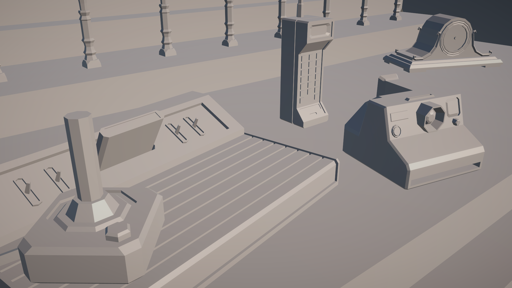

# Cavifree

## Overview
Cavifree is a screen space post-processing effect for Unity that mimics the "cavity" viewport effect found in Blender. It provides a stylized look to your scene by highlighting the edges and crevices of objects, enhancing their depth and making them look more detailed.

## Compatibility
The shader has been tested and confirmed to work on Unity 2022 LTS and Unity 2023. It includes versions for both the Universal Render Pipeline (URP) and the High Definition Render Pipeline (HDRP). Check the two different folders for more details.

## How it works
The shader calculates the curvature of surfaces by sampling normals from the normal buffer in each pixel. It analyzes how the normals change in the X and Y directions to determine the curvature, returning a value between 0.0 and 1.0 for each pixel (0.5 meaning no curvature at all). This is then blended with the image buffer with a "soft light" blending technique.

## Motivation
The idea for this shader came from screenshots sent to me by a talented 3D artist working on our game "Break, Enter, Repeat". Seeing how good this visual effect looked in Blender, I was inspired to bring a similar aesthetic to Unity. The low-poly style of our game was a perfect fit for the depth-enhancing "cavity" effect, inspiring me to start working on the development of this shader.

## Performance
Performance of the shader varies based on the sampling radius chosen. Smaller sampling radii (is that the correct word?) result in better performance. Here are some performance benchmarks based on a RTX3070 GPU, using HDRP in Unity 2023:

| Resolution   | Radius | GPU Time (ms/frame) |
|--------------|--------|---------------------|
| 1920x1080    | 0 px   | 0.1                 |
| 1920x1080    | 1 px   | 0.5                 |
| 1920x1080    | 2 px   | 1.4                 |
| 1920x1080    | 3 px   | 2.7                 |
| 2560x1440    | 0 px   | 0.1                 |
| 2560x1440    | 1 px   | 0.9                 |
| 2560x1440    | 2 px   | 2.6                 |

## Usage
Setup instructions are provided in the URP and HDRP folders in their respective README files. Users can adjust the following parameters to customize the effect:

- **Intensity** (default: 1): Controls the strength of the effect.
- **Radius** (default: 1): Specifies the pixel radius for sampling, affecting smoothness. A radius of 0 only samples the current pixel.
- **Angle Sensitivity** (default: 2.5): Together with the edge intensity multiplier setting, fine-tunes sensitivity to changes in surface angle.
- **Edge Intensity Multiplier** (default: 0.6): Multiplies the intensity of edges. The higher it is, the more edges will be fully highlighted, regardless of their angle.
- **Sharpness** (default: 0.9): Affects the importance of the current pixel compared to surrounding pixels being sampled. Has no effect when the radius is 0.

## Example

### OFF

### ON

## License
This project is licensed under the MIT License. See the [LICENSE](LICENSE) file for details.
